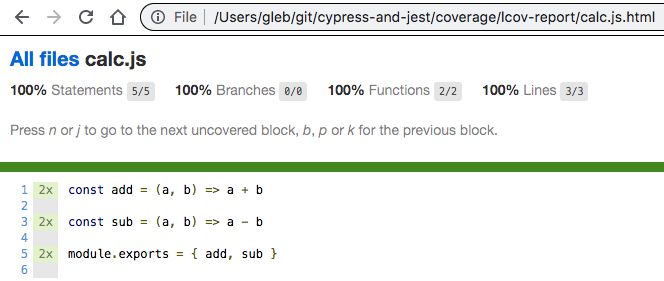
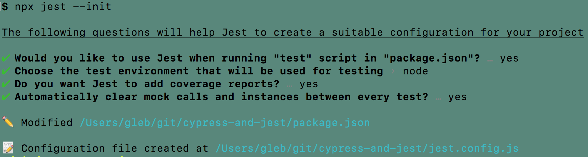
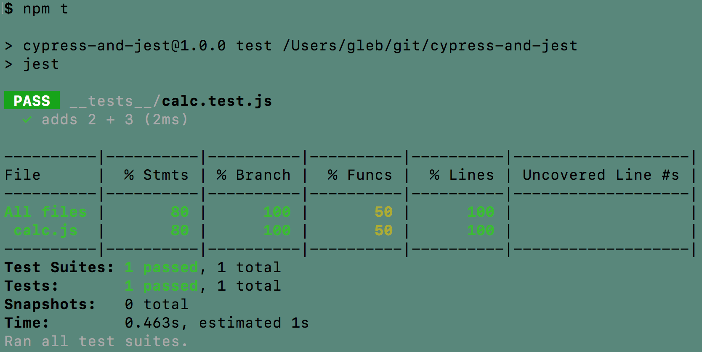
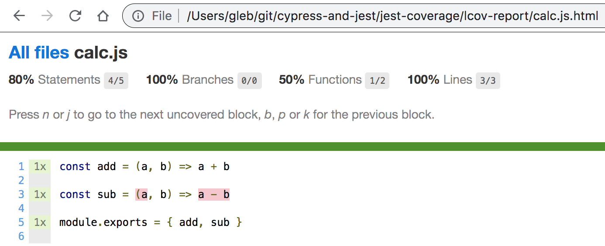
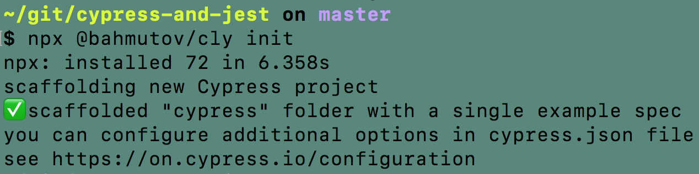
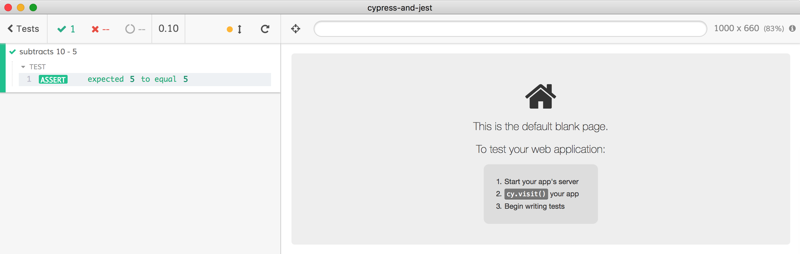
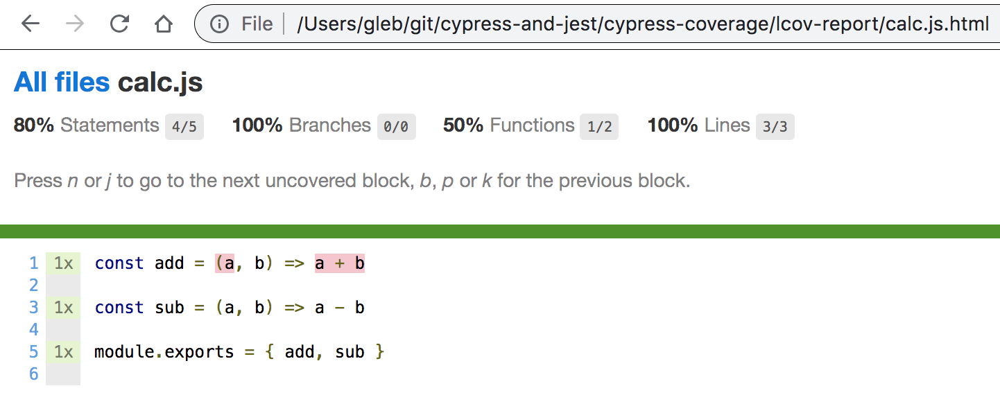
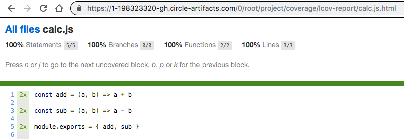

# cypress-and-jest [![renovate-app badge][renovate-badge]][renovate-app] [](https://circleci.com/gh/bahmutov/cypress-and-jest/tree/master)
> Demo unit tests with code coverage from both Cypress and Jest

## Use

```shell
# install and run tests
$ npm it
# runs Jest and Cypress tests headlessly
# generates combined code coverage report
$ open coverage/lcov-report/index.html
```



The application source code is just a single file [src/calc.js](src/calc.js). Let's cover this file with unit tests by using two test runners: [Jest](https://jestjs.io/) and [Cypress](https://www.cypress.io).

## Jest init

The Jest setting were initialized using `npx jest --init` command:



In the generated [jest.config.js](jest.config.js) enable code coverage collection, and output into folder `jest-coverage` (to avoid clashing with Cypress coverage report).

```js
// jest.config.js
module.exports = {
  // Indicates whether the coverage information should be collected while executing the test
  collectCoverage: true,
  // The directory where Jest should output its coverage files
  coverageDirectory: 'jest-coverage',
  // The test environment that will be used for testing
  testEnvironment: 'node'
}
```

The Jest unit tests are in the file [__tests__/calc.test.js](__tests__/calc.test.js) and the tests only run the `add` function. We can run the Jest tests and see the coverage summary.



The coverage reports in `jest-coverage` folder by default include JSON, LCOV and static HTML reports. The HTML report shows that the function `sub` was not reached by the Jest tests.



## Cypress init

First install Cypress

```shell
$ npm install -D cypress
```

Initialize Cypress folder with `npx @bahmutov/cly init` command.



In [cypress/integration/spec.js](cypress/integration/spec.js) let's require `sub` function and test it

```js
// cypress/integration/spec.js
const { sub } = require('../../src/calc')
it('subtracts 10 - 5', () => {
  expect(sub(10, 5)).to.equal(5)
})
```

The test passes



## Cypress code coverage setup

Code coverage in Cypress is done via [@cypress/code-coverage](https://github.com/cypress-io/code-coverage) plugin. I suggest following the installation instructions in that repo.

First, install the plugin and `babel-plugin-istanbul` to instrument code.

```sh
npm i -D @cypress/code-coverage babel-plugin-istanbul
```

Add to your [cypress/support/index.js](cypress/support/index.js) file:

```js
import '@cypress/code-coverage/support'
```

Register tasks in your [cypress/plugins/index.js](cypress/plugins/index.js) file:

```js
module.exports = (on, config) => {
  require('@cypress/code-coverage/task')(on, config)
  on('file:preprocessor', require('@cypress/code-coverage/use-browserify-istanbul'))
  return config
}
```

Because we saved the Jest coverage report in `jest-coverage`, set Cypress to save its coverage to `cypress-coverage`. Since `nyc` is used to generate the report, add `nyc` object to [package.json](package.json) file.

```json
{
  "nyc": {
    "report-dir": "cypress-coverage"
  }
}
```

Run Cypress with `npx cypress open` and a report should be saved. As you can see, we have missed the `add` function!



## Merge coverage reports

We have two folders with coverage reports generated by Jest and Cypress.

```text
$ ls -la *-coverage
cypress-coverage:
total 24
drwxr-xr-x   6 gleb  staff   204 Jul 22 23:04 .
drwxr-xr-x  20 gleb  staff   680 Jul 22 23:05 ..
-rw-r--r--   1 gleb  staff   744 Jul 22 23:05 clover.xml
-rw-r--r--   1 gleb  staff  1000 Jul 22 23:05 coverage-final.json
drwxr-xr-x  10 gleb  staff   340 Jul 22 23:04 lcov-report
-rw-r--r--   1 gleb  staff   201 Jul 22 23:05 lcov.info

jest-coverage:
total 24
drwxr-xr-x   6 gleb  staff   204 Jul 22 21:00 .
drwxr-xr-x  20 gleb  staff   680 Jul 22 23:05 ..
-rw-r--r--   1 gleb  staff   744 Jul 22 23:05 clover.xml
-rw-r--r--   1 gleb  staff  1000 Jul 22 23:05 coverage-final.json
drwxr-xr-x  10 gleb  staff   340 Jul 22 21:00 lcov-report
-rw-r--r--   1 gleb  staff   201 Jul 22 23:05 lcov.info
```

Let's combine the two reports and generate the final report. There is a script in [package.json](package.json) that does just that. It copies `cypress-coverage/coverage-final.json` and `jest-coverage/coverage-final.json` into a folder, runs `nyc merge` command, the creates the combined report using `nyc report ...` command.

```shell
$ npm run report:combined
...

coverage files in reports merged into coverage.json

> cypress-and-jest@1.0.0 report:combined /Users/gleb/git/cypress-and-jest
> nyc report --reporter lcov --report-dir coverage
```

The final HTML report shows that we have reached all source statements in `calc.js` file.


## Coverage CI artifact

You can store the produced static HTML report on your continuous integration server. For example see [.circleci/config.yml](.circleci/config.yml) file.



## More info

- Cypress [code coverage guide](https://on.cypress.io/code-coverage)
- [@cypress/code-coverage](https://github.com/cypress-io/code-coverage) plugin

[renovate-badge]: https://img.shields.io/badge/renovate-app-blue.svg
[renovate-app]: https://renovateapp.com/
